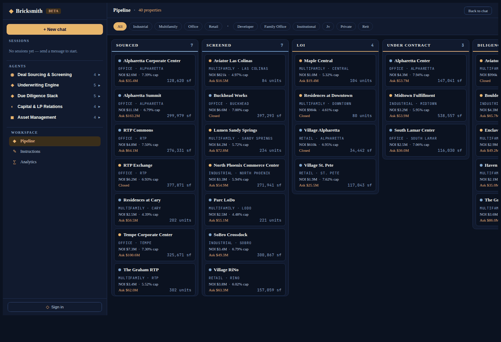

# Bricksmith

Agentic AI for commercial real estate — 22 specialist agents that underwrite, close and manage your deals.



- **Marketing landing** at `/` with hero, agent directory, how-it-works, pricing.
- **3-pane chat app** at `/app` with left agent/session browser, centre chat, right artifact pane.
- **22 LangGraph ReAct agents** across sourcing, underwriting, diligence, capital/LP, and asset management — routed by prefix (`triage:`, `pf:`, `memo:`…) or by keyword heuristics with an LLM fallback classifier.
- **xAI Grok** as the default LLM via OpenAI-compatible endpoint.
- **PostgreSQL** on the existing `DB_URL` with two schemas: `bricksmith` (OLTP — properties, rent rolls, T12s, leases, comps, pro formas, debt stacks, LP CRM, market signals) and `bricksmith_rag` (pgvector — documents, chunks, embeddings).
- **Synthetic CRE dataset** out of the box: 40 properties across 8 Sun Belt metros, ~2,600 rent-roll line items, 480 T12 months, 480 comps, 2,640 market-signal rows, 60 LP contacts, 237 indexed documents (leases, zoning memos, Phase I ESAs, PCRs, title commitments, market reports).
- **Local embeddings** via fastembed (no OpenAI key required) — BAAI/bge-small-en-v1.5 at 384 dim.

## Running locally

```bash
cp .env.example .env                    # fill DB_URL + XAI_API_KEY
python -m venv .venv && source .venv/bin/activate
pip install -r requirements.txt
python -m db.migrate                    # creates bricksmith + bricksmith_rag schemas
python -m synthetic.generate --seed 42  # populate OLTP + RAG (~1 min)
python main.py                          # serves on :5057
```

Smoke test: `curl http://localhost:5057/app/_debug/ping` → `{"ok": true, "reply": "pong"}`.
End-to-end test: `pytest -q tests/` (38 tests, under 5s, no network).

## Directory layout

```
main.py              entrypoint (thin shim)
app.py               FastHTML app, mounts landing + chat
landing/             / /platform /agents /agents/<slug> /how-it-works /pricing /contact
chat/                /app + /app/chat (SSE stream) + /app/auth/*
agents/              registry + router + 5 category packages (22 agents total)
tools/               StructuredTools: properties, rentroll, financials, market, diligence, capital, asset, rag
db/                  schema.sql, rag_schema.sql, migrate.py
rag/                 embeddings (pluggable), indexer, retriever
synthetic/           40-property CRE dataset + doc generators + RAG ingest
prompts/             per-agent system prompts + shared CRE glossary
scripts/             capture_screenshots, make_gif, make_pdf
```

## Regenerating the demo artifacts

```bash
python -m scripts.capture_screenshots   # populates ./screenshots/ (10 frames)
python -m scripts.make_gif              # → docs/bricksmith.gif
python -m scripts.make_pdf              # → docs/bricksmith-product-tour.pdf
```

See [`docs/bricksmith-product-tour.pdf`](docs/bricksmith-product-tour.pdf) for the full product walkthrough.
